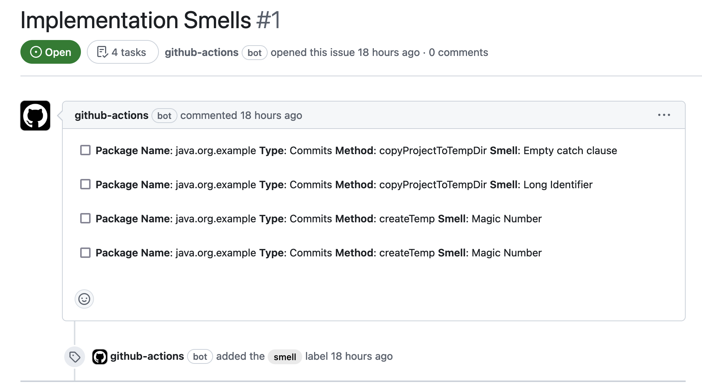

The action identifies code smells in the **newly added code and creates issues automatically** describing the newly introduced smells. It supports Java and Python projects.

## Features

- Analyzes source code at each push event using our tools DesigniteJava or DPy, based on the configuration. For Java projects, it uses [DesigniteJava](https://www.designite-tools.com/products-dj) wrapped in [DesigniteJava Action](https://github.com/marketplace/actions/designitejava-action). For Python projects, it uses [DPy](https://www.designite-tools.com/products-dpy) wrapped in [DPy Action](https://github.com/marketplace/actions/dpy-action).

- The supported smells types are *architecture smells* (for DesigniteJava only, presently), *design smells* and *implementation smells*.

- Identifies the introduced smells in the newly added code using the [designite_util](https://github.com/tushartushar/designite_util) library. 

- Creates new GitHub issues automatically describing each smell instance; consolidates the same kind of smells in one issue

## How to use this action?

### Pre-requisites
- **Personal access token**: Create a new personal access token for your GitHub repository. You may do it by going to your GitHub account's `Settings` -> `Developer settings` page. Select the `Personal access token` tab and create a new token.
Add this token to your repository's secrets. Go to `Settings` within your repository page and select `Secrets and variables` -> `Actions`. Add a new secret by pasting the access token in the `Value` field and giving a meaningful name (e.g., `PAT`).

- **Workflow permission**: Make sure that the repository's `Workflow permissions` (`Settings` -> `Actions` -> `General`) is set to **Read and write permissions**. If not, the action won't be able to create the issues or download the artifacts.

- **Designite key (optional)**: If you have a professional or academic license key for DesigniteJava/DPy, add the key to your GitHub repository secrets. Let us call it `D_KEY`. If your codebase is less than 50,000 (for DesigniteJava) and 10,000 (for DPy) lines of code, it won't impact you. It is a parameter of DesigniteTools/DJAction.

### Workflow file  

#### For Java projects using DesigniteJava
Create a GitHub Action workflow file in the repository. First, we need to analyze the latest commit using DesigniteJava; this can be achieved using the `DJ Action` action. The `DJ Action` action stores the analyzed code quality report in the Actions artifacts. 

The second key step of this exercise is to use this action with the required inputs.
An example of the file is provided below.

```yml
- name: Run Designite analysis for the latest commit
  id: designite
  uses: DesigniteTools/DJAction@v2.0
  with:
    PAT: ${{ secrets.PAT }}

- name: DesigniteJava incremental code quality analysis and issue creation
  uses: DesigniteTools/dj-incremental-analysis@v1.0.0
  with:
    github-token: ${{ secrets.GITHUB_TOKEN }}
    designite-output-old: designite-output-${{ github.event.before }}
    designite-output-new: designite-output-${{ github.sha }}
    repo-name: ${{ github.repository }}
    tool-name: 'dj'
```

- Here's an example issue created by this action:




Consider checking out this [example repository](https://github.com/tushartushar/git-utils) utilizing this action. 

#### For Python projects using DPy
Create a GitHub Action workflow file in the repository. First, we need to analyze the latest commit using DPy; this can be achieved using the `DPy Action` action. The `DPy Action` action stores the analyzed code quality report in the Actions artifacts. 

The second key step of this exercise is to use this action with the required inputs.
An example of the file is provided below.

```yml
- name: Run Designite analysis for the latest commit
  id: designite
  uses: DesigniteTools/DPyAction@v1.1.1
  with:
    PAT: ${{ secrets.PAT }}

- name: Designite incremental code quality analysis and issue creation
  uses: DesigniteTools/dj-incremental-analysis@v1.0.0
  with:
    github-token: ${{ secrets.GITHUB_TOKEN }}
    designite-output-old: designite-output-${{ github.event.before }}
    designite-output-new: designite-output-${{ github.sha }}
    repo-name: ${{ github.repository }}  
    tool-name: 'dpy'
```


Consider checking out this [example repository](https://github.com/tushartushar/embed_using_llms) utilizing this action. 