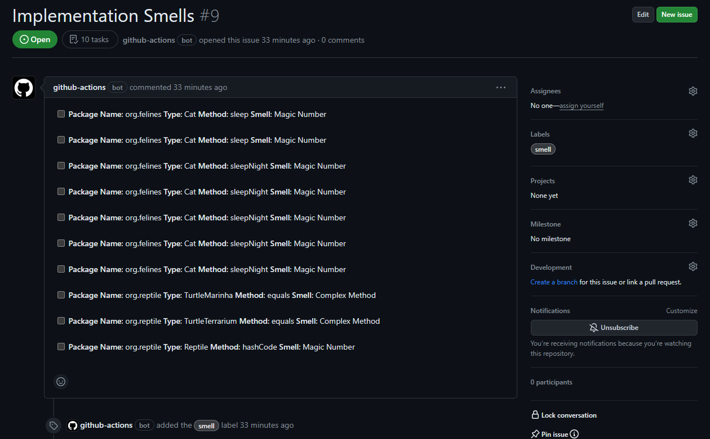

The action identifies code smells in the newly added code and creates issues automatically describing the newly introduced smells.

## Features

- Analyzes Java source code at each push event using [DesigniteJava](https://www.designite-tools.com/) wrapped in [DJAction](https://github.com/marketplace/actions/designitejava-action). The supported smells types are `Architecture Smells`, `Design Smells` and `Implementation Smells`.

- Identifies the introduced smells in the newly added code using the [designite_util](https://github.com/tushartushar/designite_util) library. 

- Creates new GitHub issues automatically describing each smell instance; consolidates the same kind of smells in one issue

## How to use this action?

### Pre-requisites
- **Personal access token**: Create a new personal access token for your GitHub repository. You may do it by going to “Settings” -> “Developer settings” page of your GitHub account. Select `Personal access token` tab and create a new token.
Add this token to your repository’s secrets. Go to `Settings` within your repository page and select `Secrets and variables` -> `Actions`. Add a new secret by pasting the access token in the `Value` field and giving a meaning name (e.g. `PAT`).

- **Workflow permission**: Make sure that the `Workflow permissions` of the repository (*settings > Actions > General*) is set to **Read and write permissions**. If it's not the case, the action won't be able to create the issues or download the artifacts.

- **DesigniteJava key (optional)**: If you have professional or academic license key of DesigniteJava, add the key to your GitHub’s repository secrets. Let us call it `D_KEY`.

### Workflow file  
Create a GitHub Action workflow file in the repository. We first needs to analyze the latest commit using DesigniteJava; it can be achieved using `DJAction` action. The `DJAction` action stores the analyzed code quality report in the Actions artifacts. 

The second key step of this exercise is to use this action with the required inputs.
An example of the file is provided below.

```yml
- name: Run Designite analysis for the latest commit
  id: designite
  uses: DesigniteTools/DJAction@v2.0
  with:
    PAT: ${{ secrets.PAT }}

- name: DesigniteJava incremental code quality analysis and issue creation
  uses: DesigniteTools/dj-incremental-analysis@v1.0.0
  with:
    github-token: ${{ secrets.GITHUB_TOKEN }}
    designite-output-old: designite-output-${{ github.event.before }}
    designite-output-new: designite-output-${{ github.sha }}
    repo-name: ${{ github.repository }}             
```

- Here's an example issue created by this action:




Consider checking out this [example repository](https://github.com/tushartushar/git-utils) utilizing this action. 

